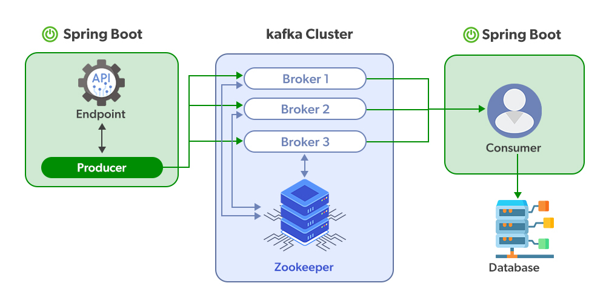

# kafka-spring

Basic Spring Apache Kafka System

Apache Kafka is a distributed and fault-tolerant stream processing system.

<br />

Step 1 : Run Zookeeper Server (Kafka uses Zookeeper to manage the entire cluster and various brokers)

```.\bin\windows\zookeeper-server-start.bat .\config\zookeeper.properties```

Step 2 : Run Kafka Server 

```.\bin\windows\kafka-server-start.bat .\config\server.properties```

## Notes

### Terminology

**Producer**: Application that sends the message\

**Consumer**: Application that receives the message\

**Kafka Broker**: AKA Kafka server

**Topic**: Unique name for data stream

**Partition**: Topic may be broken into partitions

**Offset**: Sequence number assigned to each message arriving into the Kafka server (assigned locally in partitions).

### Annotations and Functions

```KafkaAdmin(config)``` to create topics defined in the application context.

```KafkaTemplate(producerFactory)``` a template for executing high-level operations

```ProducerFactory<K,​V>``` The strategy to produce a Producer instance(s).

```@KafkaListener(topics = "${topic.name.consumer}", groupId = "group_id")``` Annotation that marks a method to be the target of a Kafka message listener on the specified topics.

```@EnableKafka``` Enable Kafka listener annotated endpoints that are created under the covers by a AbstractListenerContainerFactory.


## Reference

- [Kafka core components](https://docs.spring.io/spring-kafka/api/org/springframework/kafka/core/package-summary.html)
- [Kafka annotations](https://docs.spring.io/spring-kafka/api/org/springframework/kafka/annotation/package-summary.html)
- [Intro to Apache Kafka with Spring](https://www.baeldung.com/spring-kafka)


